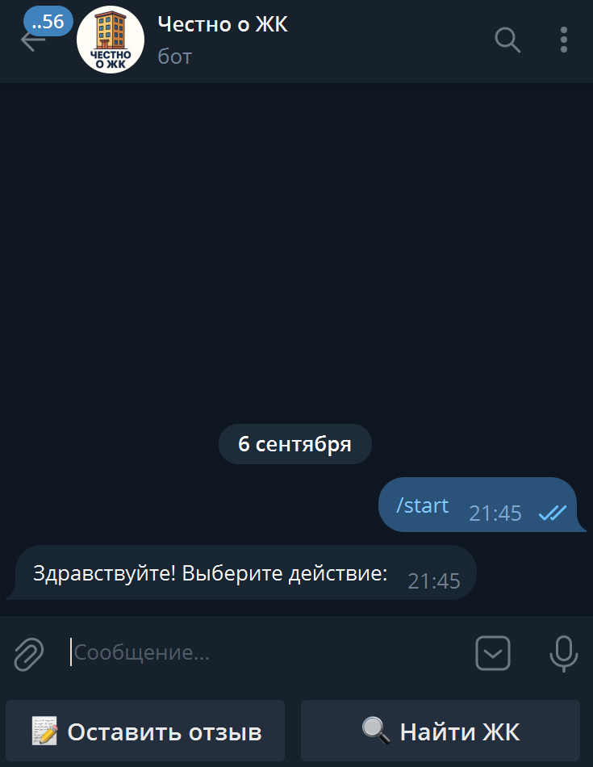
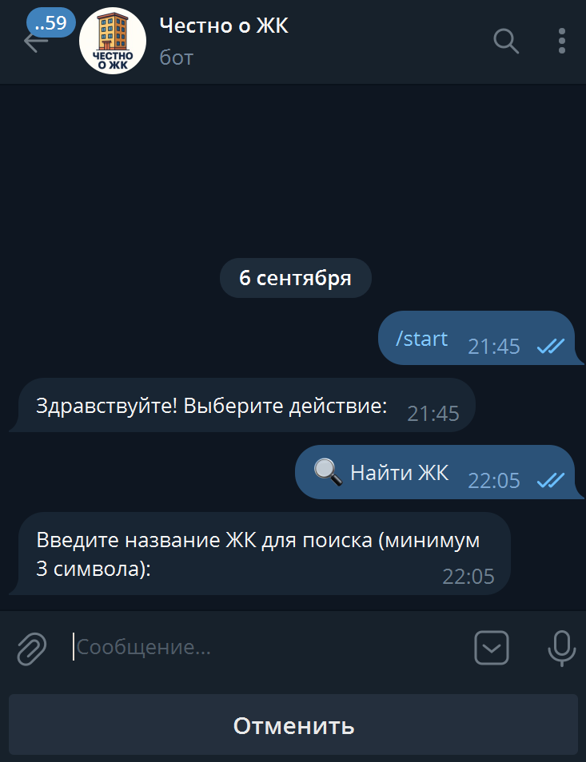
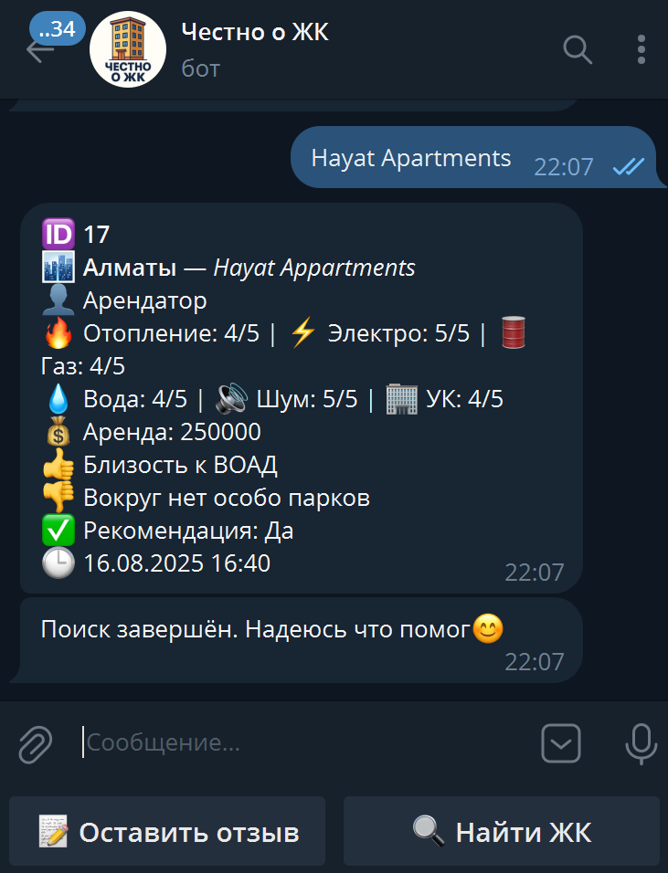
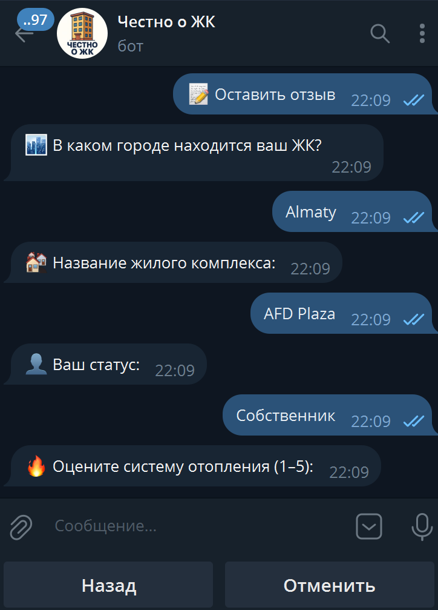
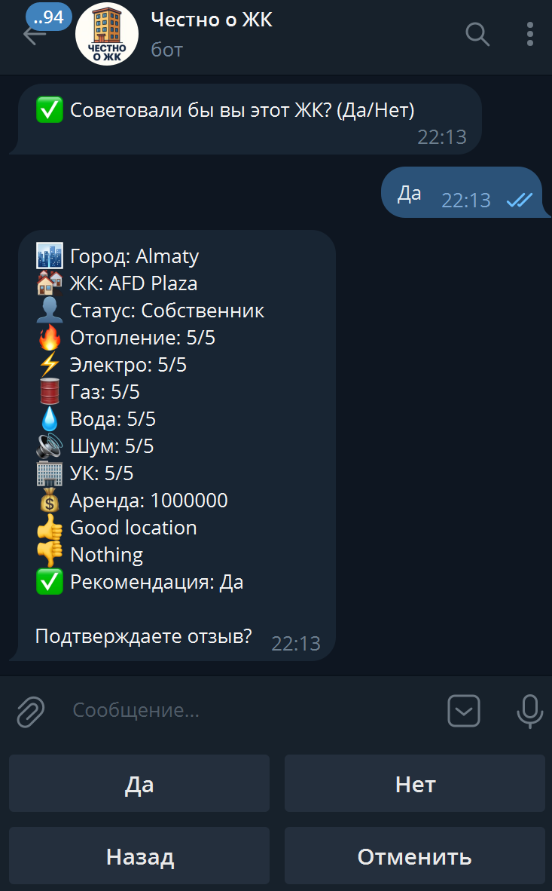
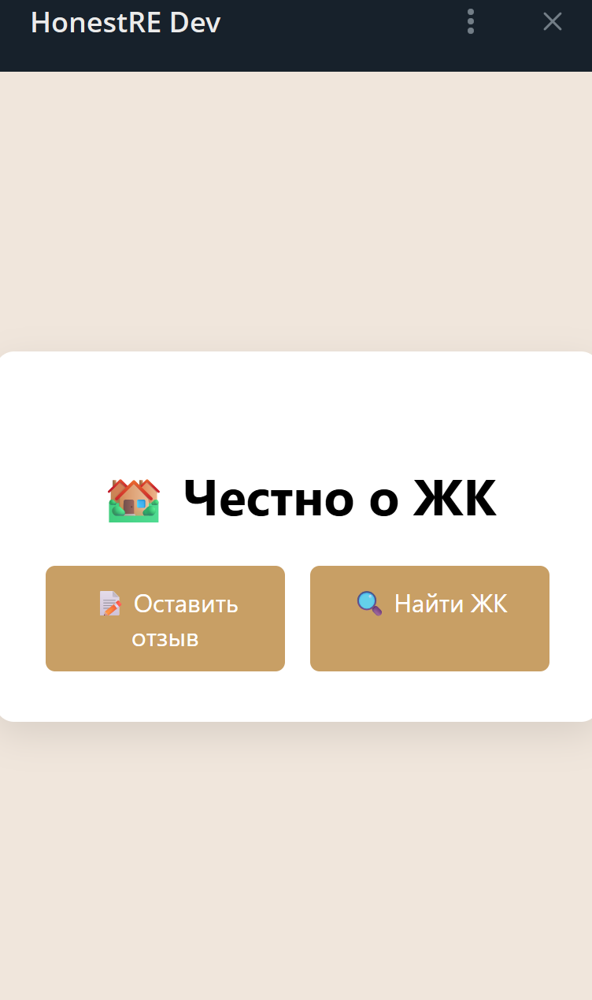

# HonestRE Bot — Telegram showcase for residential-complex reviews

**What it is.** A production Telegram bot that helps residents **search complexes**, **submit reviews**, and lets admins **moderate** content with built-in anti-spam.  
**This repository is a _showcase only_** — think museum exhibit: screenshots, short clips, and a high-level walkthrough. No public source code.

---

## Table of Contents
- [Highlights](#highlights)
- [How it works (at a glance)](#how-it-works-at-a-glance)
- [User Journey (screens)](#user-journey-screens)
- [Status & Contact](#status--contact)
- [License](#license)

---

## Highlights
- 🔎 **Search** by name of a complex using Levenshtein algorithm.
- ✍️ **Submit review**: rating → text → **confirm** → publish.
- 🛡️ **Moderation queue** for admins.
- 🚦 **Anti-spam & rate limits**.
- 🔗 **WebApp hand-off** for a richer UI (optional).
- ⚡ Designed for noisy, real-world input; fast, minimal UX.

---

## How it works (at a glance)

**Bot ↔ Core API ↔ Database**

The bot is a thin client over HTTP; business logic and storage live in Core.

- `GET /complexes/search?q=...` → list of complexes  
- `GET /complexes/{id}` → details + recent reviews  
- `POST /reviews` → create review (status = `pending`)  
- `POST /admin/moderation/{id}/decision` → approve / reject

> Endpoints shown for context only. Source code remains private.

---

## User Journey (screens)

1. **Start & menu**  
   

   
<a href="media/flow_user_01_start.webp">Open full size →</a>

2. **Search** → results list  
   

3. **Complex card** → details & recent reviews  
   

4. **Add review** → rating & text 
   

5. **Confirm & submit** → success  
   

6. *(Optional)* **Open WebApp** for a richer view  
   

---

## Status & Contact
- **Status:** active (production).  
- **Demo video:** `media/demo.mp4` *(optional — add if available)*  
- **Contact:** **mmukanovm@gmail.com**
- **Telegram Link:** **[HonestREBOT](https://t.me/HonestREBot)**
---

## License
© 2025 Madiyar Mukanov. **All rights reserved.**  
This repository is for **documentation and showcase** only. No code, copying, or redistribution without written permission.
